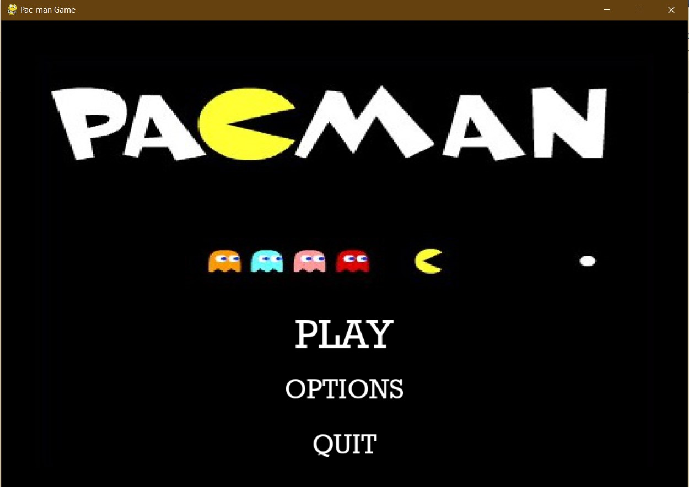

<!-- PROJECT LOGO -->
<br />
<p align="center">
  <a href="https://github.com/Hetarth-Parikh/Pac-man">
    
  </a>

  <h3 align="center">Pac-Man Game</h3>

  <p align="center">
    <a href="https://github.com/Hetarth-Parikh/Pac-man/issues">Report Bug</a>
    ·
    <a href="https://github.com/Hetarth-Parikh/Pac-man/issues">Request Feature</a>
  </p>
</p>


<!-- TABLE OF CONTENTS -->
<details open="open">
  <summary>Table of Contents</summary>
  <ol>
    <li>
      <a href="#about-the-project">About The Project</a>
      <ul>
        <li><a href="#built-with">Built With</a></li>
      </ul>
    </li>
    <li>
      <a href="#getting-started">Getting Started</a>
      <ul>
        <li><a href="#prerequisites">Prerequisites</a></li>
        <li><a href="#installation">Installation</a></li>
      </ul>
    </li>
    <li><a href="#contributing">Contributing</a></li>
    <li><a href="#contact">Contact</a></li>
  </ol>
</details>


<!-- ABOUT THE PROJECT -->
## About The Project

Pac-man is a maze arcade game. It is a basic python-based desktop application which will contain three different level based upon difficulty.
In this game we have provided different functionality to the user like he/she can control the sound or even control the quality by changing the FPS rate of game and these functionalities resides in Option page of the game


### Screenshots
-----------------




### Built With

* [Pygame In Python](https://pypi.org/project/pygame/)


<!-- GETTING STARTED -->
## Getting Started

### Prerequisites

* pygame module
  ```sh
  pip install pygame
  ```
* pillow module
  ```sh
  pip install pillow
  ```
* mixer module
  ```sh
  pip install mixer
  ```

### Installation

1. Clone the repo
   ```sh
   git clone https://github.com/Hetarth-Parikh/Pac-man
   ```
2. Open powershell in that folder and run the command 
   ```sh
   python main.py
   ```

<!-- CONTRIBUTING -->
## Contributing

Contributions are what make the open source community such an amazing place to be learn, inspire, and create. Any contributions you make are **greatly appreciated**.

1. Fork the Project
2. Create your Feature Branch (`git checkout -b feature/AmazingFeature`)
3. Commit your Changes (`git commit -m 'Add some AmazingFeature'`)
4. Push to the Branch (`git push origin feature/AmazingFeature`)
5. Open a Pull Request


<!-- CONTACT -->
## Contact

Hetarth Parikh - [@Hetarth_Parikh](https://www.linkedin.com/in/hetarth-parikh-822a521b2/) - 19bce155@nirmauni.ac.in

Dhvanil Patel - 19bce165@nirmauni.ac.in

Ashray Patel - [@Ashray_Patel](https://www.linkedin.com/in/ashray-patel-31a616190/) - 19bce161@nirmauni.ac.in

Project Link: [https://github.com/Hetarth-Parikh/Pac-man](https://github.com/Hetarth-Parikh/Pac-man)


<!-- MARKDOWN LINKS & IMAGES -->
<!-- https://www.markdownguide.org/basic-syntax/#reference-style-links -->
[contributors-shield]: https://img.shields.io/github/contributors/othneildrew/Best-README-Template.svg?style=for-the-badge
[contributors-url]: https://github.com/othneildrew/Best-README-Template/graphs/contributors
[forks-shield]: https://img.shields.io/github/forks/othneildrew/Best-README-Template.svg?style=for-the-badge
[forks-url]: https://github.com/othneildrew/Best-README-Template/network/members
[stars-shield]: https://img.shields.io/github/stars/othneildrew/Best-README-Template.svg?style=for-the-badge
[stars-url]: https://github.com/othneildrew/Best-README-Template/stargazers
[issues-shield]: https://img.shields.io/github/issues/othneildrew/Best-README-Template.svg?style=for-the-badge
[issues-url]: https://github.com/othneildrew/Best-README-Template/issues
[license-shield]: https://img.shields.io/github/license/othneildrew/Best-README-Template.svg?style=for-the-badge
[license-url]: https://github.com/othneildrew/Best-README-Template/blob/master/LICENSE.txt
[linkedin-shield]: https://img.shields.io/badge/-LinkedIn-black.svg?style=for-the-badge&logo=linkedin&colorB=555
[linkedin-url]: https://linkedin.com/in/othneildrew
[product-screenshot]: images/screenshot.png
